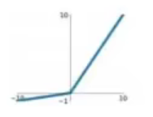
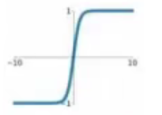
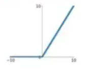
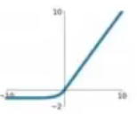

# 常见的激活函数
***
## Sigmoid
公式：$ \sigma(x) =  \frac{1}{1 + e^{-x}} $ 
图像为

***
## Leaky ReLU
公式：$ max(0.1x,x) $
图像为
***
## tanh
公式：$ tanh(x) $
图像为
***
## Maxout
公式：$ max(w^T_1x + b_1,w^T_2x + b_2) $
无图像，不常用
***
## ReLU
公式：$ max(0,x) $
图像为
***
## ELU
公式：
$$
    \begin{cases}
    x, & \text{x $\geq$ 0} \\
    \alpha(e^x - 1), & \text{x < 0}\\
  \end{cases} 
$$
图像为
***

## SoftMax函数

公式：
$$
p_i=\frac{e^{a_i}}{\sum_{k=1}^Ne^{a_k}}
$$

它的作用实际上是将最后的输出映射成一个概率分布

那么我们为什么要用softmax等等这些激活函数呢？那此激活函数举例子：

我们发现softmax函数再求导时具备一定的非常方便的特性，当i=j时，我们无须求得任何新值即可求出它的导数，当$i\neq j$ 时，他也是一个很简单的算式，这让我们在神经网络反向传播的求导工作的工作量大大减轻。并且，他还透露的一个特性，即**当被求导项与求导项相同时，它们的值为正；当不同时，他们的值为负**。这是一个很好的特性，可以帮助我们快速判断某些导数。
