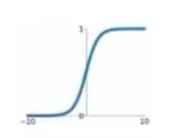

# 常见的激活函数
***
## Sigmoid
公式：$ \sigma(x) =  \frac{1}{1 + e^{-x}} $ 
图像为

***
## Leaky ReLU
公式：$ max(0.1x,x) $
图像为
***
## tanh
公式：$ tanh(x) $
图像为
***
## Maxout
公式：$ max(w^T_1x + b_1,w^T_2x + b_2) $
无图像，不常用
***
## ReLU
公式：$ max(0,x) $
图像为
***
## ELU
公式：
$$
    \begin{cases}
    x, & \text{x $\geq$ 0} \\
    \alpha(e^x - 1), & \text{x < 0}\\
  \end{cases} 
$$
图像为
***

